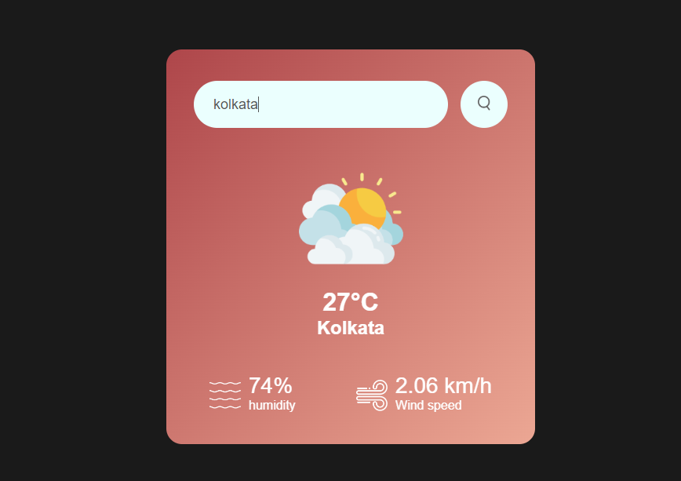

# weather-app

<h1>weather app, build using html,css and vanila js</h1>

download the code file and run the index.html file to have a experience of the code.

<h3>thank you, made with tea and love</h3>>
